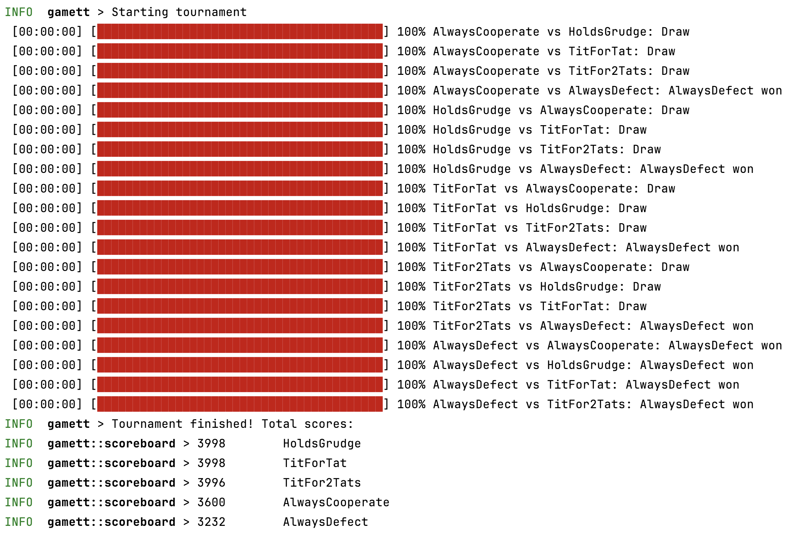

# game-theory-tournament-rust

## Game Theory Tournament in Rust

This is a simulation of how effective different game theory strategies are.
Every strategy will play against every other strategy and the results will be recorded.

A strategy has memory and can make decisions based on the history of each battle.

## Dependencies

- Rust
- Cargo

## How to run

First set log level:

```bash
export RUST_LOG=info
```

Run with default parameters (200 iterations, no verbose):

```bash
$ cargo run
```

Run with verbose, set number of iterations:

```bash
cargo build && ./target/debug/gamett --verbose --iterations 1000
```



## How to test

```bash
cargo test
```

## Join the tournament

Clone this repository, add a new file with your strategy and make a pull request.
